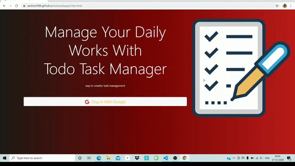

     

# todowebapp
Todo app is a SAAS, which is capable of handling the daily task of any user. This web app tracks one single task in three different phases starting from "pending" to "in progress" then finally "completed" phase.

#### When the user adds any task in the todo app its status is set into "pending" mode. So let's talk about the "pending" phase.

## Pending Phase:

In this phase, alteration is the task name is feasible only. Apart from that, a particular task could be also deleted/upgraded into in progress phase as well. 
Now if a particular task, let say "have a tea" is added in the add task section. One task with the name, "have a tea" will appear in the pending task section with edit, in progress, and delete buttons. So as the name suggests by clicking the edit button is used for editing the task name(only task name can be edited, the status of a task can't be edited it's only capable of toggling), In progress, the button is used for changing the status of a particular task, and delete button used for completely erase the task. 

#### When the users hit in progress button of any task displayed in the pending task section, it appears in the "in progress" section.

## InProgress Phase :

In this phase, one task can only be toggled in-between "pending" and "completed" using the "pending" and "complete" buttons.

#### When the user finishes one task and presses the complete button of any task present in the "in progress" section it's moved to the "completed" section.

## Completed Phase:

This is the final stage of any task. Once a task reaches this final stage it's can be deleted or demoted to "in progress" stage depending upon users' choices.

